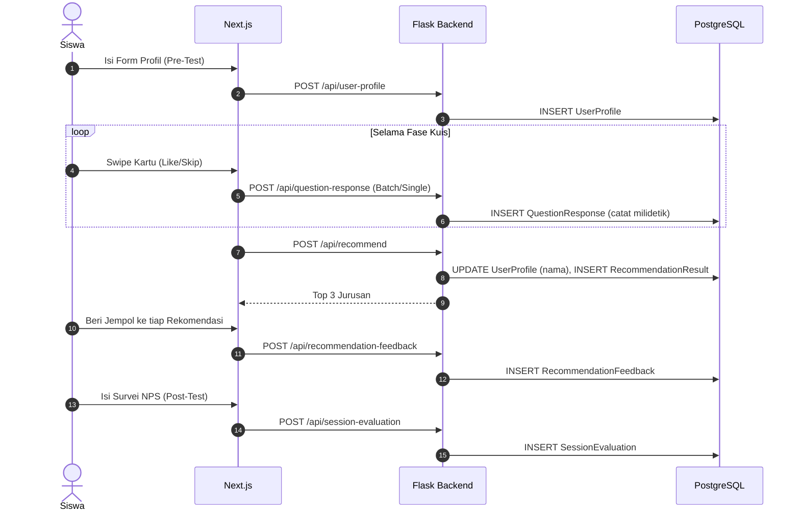
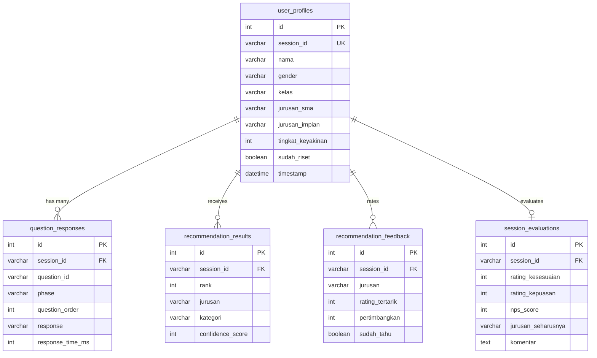

# Panduan Akademik & Dokumen Teknis: Major & Match (M&M)
### Sistem Rekomendasi Jurusan Kuliah Interaktif Berbasis Natural Language Processing (NLP), Active Learning (Entropy), dan Beta Testing Validation

---

## 📋 DAFTAR ISI
1. **Pendahuluan & Konsep Utama**
2. **Arsitektur Sistem Terkini**
3. **Bedah Struktur Direktori (Codebase)**
4. **Alur Validasi Beta Testing (Baru)**
5. **Skema & Desain Database (PostgreSQL)**
6. **Matematika & Teori Kecerdasan Buatan (ML Core)**
7. **Spesifikasi & Endpoint REST API**
8. **Petunjuk Instalasi, Pengoperasian & Pengujian**

---

## 1. Pendahuluan & Konsep Utama

**Major & Match (M&M)** adalah platform berbasis Kecerdasan Buatan (AI) untuk membantu pelajar SMA/SMK sederajat dalam menemukan jurusan kuliah yang paling sesuai dengan minat dan kepribadian mereka. 

Aplikasi ini menggantikan kuesioner psikotes tradisional yang panjang dan membosankan dengan antarmuka **Swipe Card** (Tinder-style). Dibalik antarmuka sederhana ini, mesin AI secara adaptif mengkalkulasi entropi jawaban pengguna untuk menyajikan pertanyaan berikutnya yang memiliki *Information Gain* tertinggi.

> [!NOTE]
> Pada iterasi terbaru ini, arsitektur M&M telah di-upgrade secara masif untuk mendukung **Fase Beta Testing Ekstensif**. Semua *legacy code* telah dibersihkan, dan sistem kini menggunakan PostgreSQL (via Railway) untuk merekam jejak audit interaksi secara granular (hingga satuan milidetik waktu berpikir *user* pada setiap pertanyaan).

---

## 2. Arsitektur Sistem Terkini

Sistem M&M dibangun menggunakan pola arsitektur **Clean Client-Server**:

- **Frontend (Client)**: **Next.js (React 19) + TypeScript**. Berfokus penuh pada penyajian UI/UX yang dinamis, animasi (*Framer Motion*), dan manajemen state sisi klien (*localStorage*).
- **Backend (API Server)**: **Python Flask**. Menyediakan REST API yang mengelola *rate limiting*, interaksi database ORM, serta pemrosesan *payload*.
- **Machine Learning Engine**: **Scikit-Learn & Pandas**. Terintegrasi di dalam backend Flask sebagai modul *singleton* untuk kalkulasi Cosine Similarity, TF-IDF, dan Shannon Entropy secara real-time.
- **Database**: **PostgreSQL** via Railway Cloud (beralih dari SQLite lokal untuk stabilitas konkurensi di Production). Dimanajemen sepenuhnya menggunakan migrasi **Alembic (Flask-Migrate)**.

---

## 3. Bedah Struktur Direktori (Codebase)

```text
major-match/
├── backend/                        # Subsistem Flask Python (API & Machine Learning)
│   ├── app/
│   │   ├── __init__.py             # Factory method inisialisasi aplikasi (DB, CORS, Cache)
│   │   ├── models.py               # Definisi Skema Tabel PostgreSQL (Beta Testing Schema)
│   │   ├── schemas.py              # Validasi payload menggunakan Marshmallow
│   │   ├── routes/api.py           # Controller seluruh REST API Endpoints
│   │   └── services/ml_service.py  # Algoritma Inti Machine Learning (TF-IDF, Entropy, Rocchio)
│   ├── data/
│   │   ├── jurusan_processed.csv   # Dataset 236 jurusan hasil web-scraping & integrasi teks
│   │   └── questions.json          # Bank data kartu swipe beserta tag mapping-nya
│   ├── migrations/                 # Direktori file migrasi database Alembic
│   ├── model/                      # Direktori output model biner TF-IDF (.pkl)
│   ├── preprocess.py               # Pipeline kompilasi data CSV menjadi model biner .pkl
│   └── run.py                      # Skrip entrypoint utama server WSGI (Gunicorn) / lokal
│
└── frontend/                       # Subsistem Antarmuka (Next.js)
    ├── package.json                # Dependensi (Next.js, Framer Motion, Lucide Icons)
    └── src/app/
        ├── layout.tsx              # Konfigurasi dasar HTML & Vercel Analytics
        ├── globals.css             # Tema CSS Kustom (Glassmorphism, Gradient)
        ├── page.tsx                # Halaman Kuis Interaktif
        ├── explore/page.tsx        # Halaman Pencarian & Jelajah Seluruh Jurusan
        ├── detail/[jurusan]/       # Halaman Detail Prospek Gaji & Keahlian per-Jurusan
        └── stats/page.tsx          # Dashboard Visual Statistik Real-time (Admin)
```

---

## 4. Alur Validasi Beta Testing (Baru)

Sistem lama telah dirombak untuk mengakomodasi pencatatan data empiris yang ditujukan bagi penelitian akademik (skripsi/tesis).



---

## 5. Skema & Desain Database (PostgreSQL)

Skema database telah melalui tahap *normalization* ketat. Tabel `feedback_sessions` yang redundan telah dihancurkan sepenuhnya.



> [!IMPORTANT]
> Seluruh tabel turunan (relasi satu-ke-banyak) dilengkapi dengan konstrain `ForeignKey(ondelete='CASCADE')`. Jika satu `session_id` pada `user_profiles` dihapus, seluruh data turunan (respon kuis, hasil rekomendasi, evaluasi) otomatis musnah demi kebersihan integritas data (*Referential Integrity*).

---

## 6. Matematika & Teori Kecerdasan Buatan (ML Core)

Semua logika kecerdasan dirangkum di dalam berkas `ml_service.py` tanpa pemanggilan pihak ketiga (API eksternal).

### A. Vektorisasi Minat (TF-IDF N-Gram)
Sistem merepresentasikan profil dari ratusan jurusan ke dalam bentuk metrik matematika dengan **Term Frequency - Inverse Document Frequency (TF-IDF)** menggunakan rentang ekstraksi 1 hingga 2 suku kata berkelanjutan (Bigram).

$$ \text{TF-IDF}(t, d) = \text{TF}(t, d) \times \left( \log \left( \frac{1 + N}{1 + \text{DF}(t)} \right) + 1 \right) $$

### B. Pencocokan (Cosine Similarity)
Pemetaan tingkat kedekatan profil jawaban siswa terhadap vektor target jurusan dihitung dengan formula sudut kosinus antar-vektor (*Cosine Similarity*):

$$ \cos(\theta) = \frac{\sum_{i=1}^{n} U_i V_i}{\sqrt{\sum_{i=1}^{n} U_i^2} \cdot \sqrt{\sum_{i=1}^{n} V_i^2}} $$

### C. Pembaruan Profil (Rocchio Feedback Algorithm)
Mesin M&M tidak bekerja linier, ia bereaksi setiap kali pengguna men-swipe. Kami mendesain algoritma turunan Rocchio untuk menggeser preferensi vektor ( $U$ ) mendekat pada *tag* yang di-Like, dan menjauhi *tag* yang di-Skip.

$$ \vec{U} = \max(\vec{U}_{\text{pos}} - 0.5 \cdot \vec{U}_{\text{neg}}, 0) $$

### D. Active Learning (Shannon Entropy)
Untuk menjamin pertanyaan tidak mubazir, AI selalu mensimulasikan probabilitas pembagian kandidat rekomendasi ( $P(C)$ ) dan menyajikan kartu berikutnya dengan nilai **Entropi** paling meragukan tertinggi (mendekati 1.0).

$$ H(C) = - P(C) \log_2 P(C) - (1 - P(C)) \log_2 (1 - P(C)) $$

*Untuk mencegah filter-bubble (*Echo Chamber*), algoritma `Epsilon-Greedy` (15% probabilitas) diterapkan untuk memaksa pengguna melihat kartu dari rumpun bidang minat lain yang belum pernah dikunjungi.*

---

## 7. Spesifikasi & Endpoint REST API

Payload dilindungi oleh pustaka `Marshmallow`. Permintaan berlebih diproteksi oleh `Flask-Limiter`.

| Endpoint | Method | Fungsi / Tujuan |
|----------|--------|----------------|
| `/api/health` | GET | Cek konektivitas PostgreSQL dan status Load Model (*Monitoring*). |
| `/api/user-profile` | POST | Menyimpan data demografi Tester (Pre-Test). |
| `/api/next-card` | POST | Mengirim riwayat kuis, menerima rekomendasi kartu kuis berikutnya (Fase Eksekusi). |
| `/api/question-response` | POST | *[Beta-Test]* Merekam pilihan *"Like/Skip"* lengkap beserta metrik milidetik. |
| `/api/recommend` | POST | Fase klimaks. Menerima keseluruhan kuis dan mengembalikan **Top 3 Jurusan**. |
| `/api/recommendation-feedback`| POST | *[Beta-Test]* Merekam ketertarikan tester secara spesifik terhadap Top 3 yang dihasilkan. |
| `/api/session-evaluation` | POST | *[Beta-Test]* Merekam kuesioner NPS (*Net Promoter Score*) dan kepuasan Post-Test. |
| `/api/explore` | POST | Mengeksekusi pencarian vektor pencocokan bebas bagi pengguna di halaman eksplorasi. |
| `/api/detail/<jurusan>`| GET | Memuat profil detail jurusan (di-Cache 3600 detik). |
| `/api/stats` | GET | Memuat statistik performa (NPS, kepuasan, rating), *Protected by X-Admin-Key Header*. |

---

## 8. Petunjuk Instalasi, Pengoperasian & Pengujian

### Persyaratan Lingkungan
- **Python 3.9+** (Rekomendasi Conda/Venv)
- **Node.js 18+** (Frontend React Next.js)
- Database PostgreSQL yang berjalan (Opsional: SQLite bisa dikembalikan secara manual di `config.py`)

### A. Persiapan Backend
```bash
cd backend
pip install -r requirements.txt

# Proses Dataset Mentah menjadi Model Biner TF-IDF
python preprocess.py

# Inisialisasi Database (Hanya sekali jika DB kosong)
flask db upgrade

# Nyalakan API Server
python run.py
```
*Akses backend berjalan di port `:5000`*

### B. Persiapan Frontend
```bash
cd frontend
npm install

# Jalankan dalam mode pengembangan
npm run dev
```
*Akses aplikasi antarmuka di `http://localhost:3000`*

### C. Utilitas Riset (*Export* Data)
Bagi kebutuhan analisis skripsi atau tesis, Anda dapat mengekstrak seluruh tabel PostgreSQL menjadi CSV siap-olah di Excel/SPSS. Edit `.env` Anda dengan *Connection String* PostgreSQL, lalu jalankan:

```bash
cd backend
python export_data.py
```
*Data kuis komprehensif akan di-_dump_ ke berkas CSV di dalam direktori `backend/`.*
