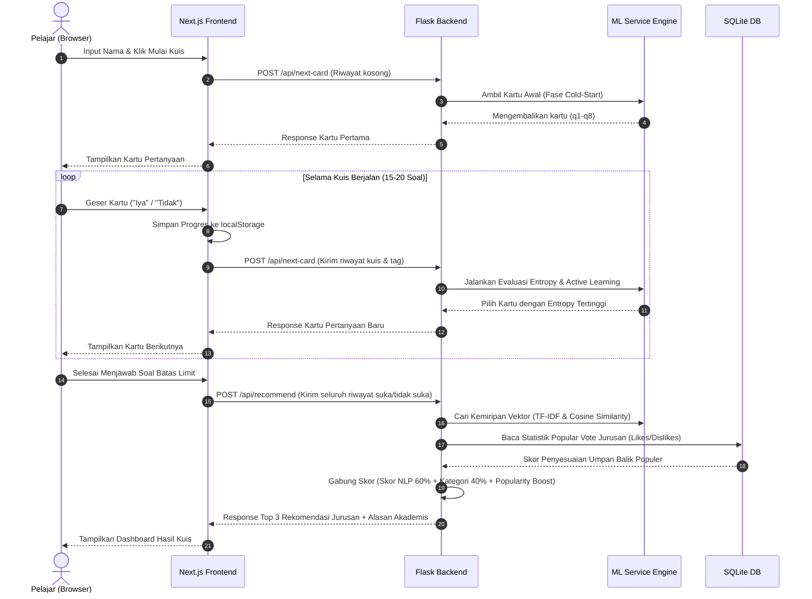
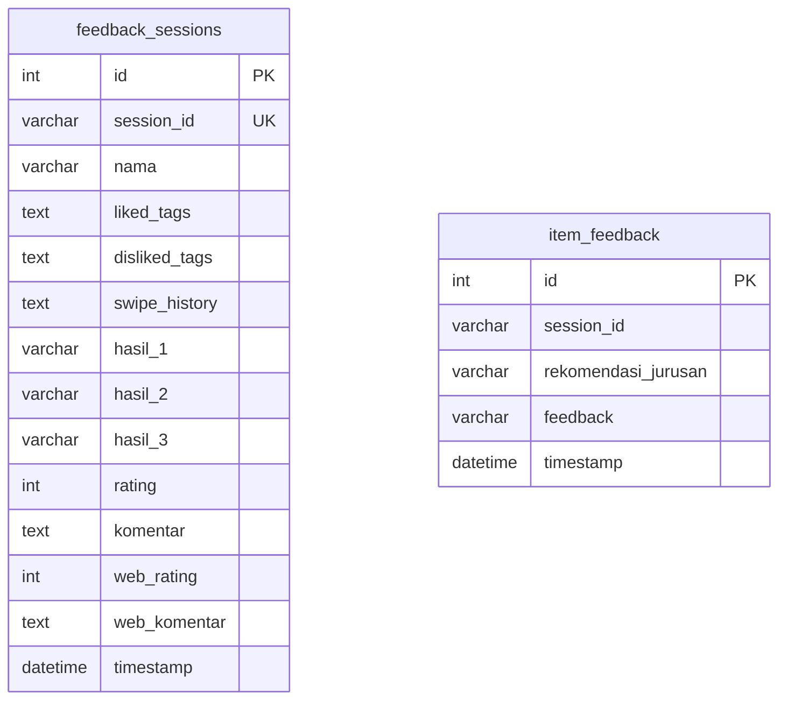

# Panduan Akademik & Dokumen Teknis Lengkap: Major & Match (M&M)
### Sistem Rekomendasi Jurusan Kuliah Interaktif Berbasis Natural Language Processing (NLP), Active Learning (Entropy-Based), dan Rocchio Feedback Loop

---

## 📋 DAFTAR ISI
1. **Pendahuluan & Nilai Jual Utama**
   - Latar Belakang Masalah
   - Solusi & Filosofi Desain Interaktif (Tinder-Style Swipe)
2. **Arsitektur Sistem & Alur Data**
   - Desain Clean Client-Server
   - Diagram Arsitektur & Alur State
   - Peran Subsistem
3. **Bedah File Proyek Secara Mendalam (Codebase File-by-File)**
   - Komponen Backend (Python / Flask)
   - Komponen Frontend (Next.js / TypeScript)
4. **Matematika & Teori Kecerdasan Buatan (ML Core Deep-Dive)**
   - NLP & Representasi Vektor: TF-IDF N-Gram
   - Mengukur Tingkat Kemiripan: Cosine Similarity
   - Penyesuaian Preferensi Pengguna: Rocchio Feedback Loop
   - Efisiensi Pertanyaan: Shannon Entropy & Active Learning
   - Penanganan Awal Kuis: Cold-Start Diversification & Random Noise
   - Feedback Kolektif: SQLite Popularity Boost
5. **Skema & Desain Database (SQLite)**
   - Desain Relasional Database
   - Struktur Tabel & Kode SQL DDL
6. **Spesifikasi & Endpoint REST API**
   - Endpoint `/api/next-card` [POST]
   - Endpoint `/api/recommend` [POST]
   - Endpoint `/api/explore` [POST]
   - Endpoint `/api/detail/<nama_jurusan>` [GET]
   - Endpoint `/api/feedback` [POST]
   - Endpoint `/api/item-feedback` [POST]
   - Endpoint `/api/stats` [GET]
   - Validasi Keamanan & Caching (Limiter & SimpleCache/Redis)
7. **Logika State & Interaktivitas Antarmuka (Frontend UX)**
   - Pemulihan Sesi Kuis (`localStorage` Session Resume)
   - Reset Total Midway Quiz (Keluar Kuis)
   - Detail Profil Minat Modal
   - Dashboard Perbandingan Jurusan (Gaji Bar & Keahlian Unik)
   - Pencarian & Filter Instan Halaman Explore
8. **Petunjuk Instalasi, Pengoperasian & Pengujian**
   - Persyaratan Sistem
   - Instalasi Dependensi
   - Eksekusi Skrip Preprocessing ML
   - Menjalankan Aplikasi Lokal
   - Otomatisasi Unit Testing (Pytest)

---

## 1. Pendahuluan & Nilai Jual Utama

### Latar Belakang Masalah
Pemilihan jurusan kuliah adalah keputusan krusial pertama dalam karir seorang pelajar. Fenomena salah jurusan (*major mismatch*) di Indonesia masih sangat tinggi, sering kali disebabkan oleh:
* Penggunaan tes minat bakat konvensional (statis) dengan ratusan pertanyaan tertulis yang membosankan dan melelahkan (*user fatigue*).
* Minimnya informasi pembanding yang objektif dan visual mengenai keahlian yang diajarkan, prospek karir, serta estimasi gaji antar jurusan.
* Rekomendasi yang tidak sensitif terhadap tren industri baru (seperti bidang AI, Data Science, atau UI/UX).

### Solusi & Filosofi Desain Interaktif
**Major & Match (M&M)** memadukan pendekatan psikometrik sederhana dengan kekuatan **Kecerdasan Buatan (AI)**. Aplikasi ini membuang format kuesioner kuno dan menggantinya dengan antarmuka **Swipe Card** yang populer (geser kanan untuk "Iya", geser kiri untuk "Tidak").

> [!NOTE]
> Melalui interaksi dinamis ini, AI secara adaptif mengevaluasi jawaban pengguna pada setiap geseran kartu dan merumuskan pertanyaan berikutnya yang **paling informatif**. Kuis dirancang selesai hanya dalam **15 hingga 20 pertanyaan** dari ratusan tag keahlian yang terdata.

---

## 2. Arsitektur Sistem & Alur Data

Sistem M&M dibangun menggunakan pola arsitektur **Client-Server** yang terpisah secara fisik maupun logika (*separation of concerns*). Hal ini memastikan backend yang memproses Machine Learning (ML) tetap ringan dan mandiri, sedangkan frontend Next.js berfokus penuh pada penyajian UI/UX yang responsif dan berestetika premium (*glassmorphism*).

### Diagram Alur Data & State


### Peran Subsistem
1. **Frontend (Client Application)**:
   * Mengatur interaktivitas rendering kartu kuis (efek *spring transition*).
   * Mengelola ketahanan status kuis menggunakan `localStorage` agar tidak hilang jika browser ditutup atau di-refresh secara tidak sengaja.
   * Melakukan komparasi sisi-klien untuk menyortir keahlian unik (*unique skills*) dan merender diagram gaji.
2. **Backend (API Server)**:
   * Menyediakan API endpoints berformat JSON.
   * Menerapkan pembatasan laju permintaan (*Rate Limiting*) per IP address demi mencegah serangan DoS.
   * Melakukan caching pada query basis data statis (detail jurusan) selama 1 jam menggunakan memori lokal demi efisiensi tinggi.
3. **Machine Learning Service (ML Engine)**:
   * Merepresentasikan dokumen karakteristik jurusan ke ruang vektor multidimensi.
   * Memelihara status vektor preferensi pengguna.
   * Membagi ruang pencarian pertanyaan menggunakan teori informasi Shannon Entropy.

---

## 3. Bedah File Proyek Secara Mendalam (Codebase File-by-File)

Berikut adalah struktur kode file-by-file beserta penjelasan perannya di dalam sistem:

```
major-match/
├── DOKUMENTASI.md                  # File dokumentasi utama (file ini)
├── backend/                        # Subsistem Flask Python (API & Machine Learning)
│   ├── config.py                   # Konfigurasi aplikasi Flask, Database URI, Rate Limiter, & Cache
│   ├── preprocess.py               # Skrip pipeline NLP untuk memproses data mentah CSV ke model biner pkl
│   ├── run.py                      # File entrypoint untuk menyalakan server lokal Flask
│   ├── requirements.txt            # Daftar pustaka Python yang wajib diinstal
│   ├── app/
│   │   ├── __init__.py             # Factory method inisialisasi Flask, DB, CORS, Cache, & Limiter
│   │   ├── models.py               # Definisikan tabel SQLAlchemy ORM (SQLite schema)
│   │   ├── schemas.py              # Definisikan validasi skema request/response payload (Marshmallow)
│   │   ├── routes/
│   │   │   └── api.py              # Logic controller dari semua REST API endpoints
│   │   └── services/
│   │       └── ml_service.py       # Core Machine Learning (TF-IDF, Cosine Similarity, Rocchio, Entropy)
│   ├── data/
│   │   ├── jurusan_clean.csv       # Dataset mentah 236+ jurusan beserta profilnya
│   │   ├── jurusan_processed.csv   # Dataset terproses pasca integrasi teks gabungan
│   │   └── questions.json          # Kumpulan kartu kuis beserta tag minatnya
│   ├── model/
│   │   ├── tfidf_matrix.pkl        # Matriks biner vektor TF-IDF dari seluruh jurusan
│   │   └── vectorizer.pkl          # Model biner TfidfVectorizer yang sudah di-fit
│   └── tests/
│       ├── conftest.py             # Konfigurasi fixture pengujian Flask test client
│       └── test_api.py             # Kumpulan unit-test backend (pytest) untuk validasi logika kuis
│
└── frontend/                       # Subsistem Next.js TypeScript (Antarmuka Pengguna)
    ├── package.json                # Konfigurasi dependensi npm Next.js, React, & Tailwind (bila ada)
    ├── next.config.ts              # Konfigurasi Next.js, termasuk rewrite proxy /api/* ke backend Flask
    └── src/
        └── app/
            ├── layout.tsx          # Konfigurasi meta SEO utama (title, desc, keywords) dan font Google (Nunito)
            ├── globals.css         # CSS Kustom untuk tema glassmorphism, orbs, animasi, dan perbandingan gaji
            ├── page.tsx            # Halaman Beranda, Kuis Swipe, dan Dashboard Hasil Rekomendasi
            ├── explore/
            │   └── page.tsx        # Halaman Jelajah Jurusan, Pencarian Pintar, & Tombol Filter Karir
            ├── detail/
            │   └── [nama_jurusan]/
            │       └── page.tsx    # Halaman detail individu jurusan, visualisasi gaji, & tautan referensi
            └── stats/
                └── page.tsx        # Halaman visual statistik aplikasi (total responden, rating rata-rata)
```

---

## 4. Matematika & Teori Kecerdasan Buatan (ML Core Deep-Dive)

Kekuatan utama rekomendasi cerdas M&M terletak pada formulasi matematika di `backend/app/services/ml_service.py`. Berikut adalah penjelasan teoretis rumus yang digunakan:

### A. NLP & Representasi Vektor: TF-IDF N-Gram
Sebelum kuis dimulai, seluruh data jurusan kuliah harus diubah dari teks deskriptif menjadi angka representatif. Skrip `preprocess.py` menggabungkan kolom data jurusan dengan cara menggabungkan teks (konkatenasi):

$$
\text{Dokumen}_d = \text{NamaJurusan} + \text{Kategori} + \text{Skills} + \text{Karier} + \text{Deskripsi}
$$

*(Simbol $+$ di atas melambangkan penggabungan string atau konkatenasi teks)*

Untuk merepresentasikan seberapa pentingnya kata $t$ dalam dokumen jurusan $d$ pada seluruh dokumen database $D$, sistem menggunakan pembobotan **TF-IDF (Term Frequency - Inverse Document Frequency)**:

$$
\text{TF-IDF}(t, d, D) = \text{TF}(t, d) \times \text{IDF}(t, D)
$$

Di mana:

1. **Term Frequency (TF)** adalah frekuensi kemunculan kata $t$ di dokumen $d$:

$$
\text{TF}(t, d) = \text{Frekuensi kemunculan kata } t \text{ di dokumen } d
$$

2. **Inverse Document Frequency (IDF)** mengukur seberapa unik suatu kata di seluruh koleksi jurusan:

$$
\text{IDF}(t, D) = \log \left( \frac{1 + \vert D \vert}{1 + \text{DF}(t)} \right) + 1
$$

* $\vert D \vert$ = Total seluruh jurusan di database (236 jurusan).
* $\text{DF}(t)$ = Jumlah jurusan yang mengandung kata $t$. 
* Konstanta $+1$ ditambahkan pada pembilang dan penyebut untuk mencegah pembagian dengan nol (*zero division protection*), serta di luar logaritma untuk menghindari nilai pembobotan bernilai nol.

> [!TIP]
> Kami menggunakan konfigurasi `ngram_range=(1, 2)`. Ini berarti model mengekstrak kata tunggal (*unigram*) seperti `"komputer"` serta pasangan dua kata berurutan (*bigram*) seperti `"ilmu komputer"` atau `"desain grafis"`. Hal ini sangat krusial karena makna dari sebuah keahlian sering kali hilang jika dipotong per kata.

### B. Mengukur Kemiripan: Cosine Similarity
Profil minat pengguna (direpresentasikan sebagai vektor preferensi $U$) dicocokkan dengan setiap vektor karakteristik jurusan $V$ di database menggunakan **Cosine Similarity** (mengukur sudut kosinus antara dua vektor di ruang multidimensi):

$$
\text{Similarity}(U, V) = \cos(\theta) = \frac{U \cdot V}{\lVert U \rVert \cdot \lVert V \rVert} = \frac{\sum_{i=1}^{n} U_i V_i}{\sqrt{\sum_{i=1}^{n} U_i^2} \cdot \sqrt{\sum_{i=1}^{n} V_i^2}}
$$

*(Di mana $\lVert U \rVert$ dan $\lVert V \rVert$ melambangkan panjang/norma dari masing-masing vektor)*

Nilai Cosine Similarity berkisar antara $0.0$ (tidak ada irisan kata sama sekali) hingga $1.0$ (vektor berimpit sempurna / sama persis). Di frontend, nilai kemiripan ini diproyeksikan ke skala persentase kecocokan yang intuitif bagi calon mahasiswa baru:

$$
\text{Match Percentage} = \min(\text{round}(\text{Similarity} \times 300), 99)
$$

*(Nilai akhir dikonversi ke skala persentase $0\%$ hingga $99\%$)*

Skala pengali $300$ memastikan bahwa kecocokan moderat (misalnya nilai similarity $0.3$) tetap terproyeksi secara realistis sebagai kecocokan sekitar $90\%$ agar lebih ramah bagi psikologis pengguna.

### C. Pembaruan Minat: Rocchio Feedback Loop
Setiap kali pengguna melakukan *swipe* kartu kuis, preferensi minat mereka berubah secara *real-time*. AI M&M menggunakan bentuk modifikasi dari **Rocchio Relevance Feedback Algorithm** untuk menggeser vektor kueri pengguna mendekati jurusan yang disukai dan menjauhi jurusan yang ditolak.

Sistem menghitung **Bobot Bersih (*Net-Weight*)** untuk setiap tag keahlian/minat $T$:

$$
\text{Bobot Bersih}(T) = (N_{\text{like}} \times 1.0) - (N_{\text{dislike}} \times 0.5)
$$

Di mana:
* $N_{\text{like}}$ = Frekuensi tag $T$ berada pada kartu kuis yang dijawab "Iya" (*positive feedback*).
* $N_{\text{dislike}}$ = Frekuensi tag $T$ berada pada kartu kuis yang dijawab "Tidak" (*negative feedback*).
* Bobot penolakan sengaja dibuat lebih kecil ($0.5$) agar penolakan satu pertanyaan tidak langsung menghapus seluruh opsi jurusan terkait yang mungkin memiliki tag positif lain.

**Mekanisme Pembaruan Vektor**:

1. Filter semua tag yang memiliki $\text{Bobot Bersih}(T) > 0$.
2. Bangun representasi teks preferensi positif pengguna dengan mereplikasi tag positif sebanyak pembulatan bobot bersihnya untuk memperkuat sinyal:
$$
\text{Teks Positif} = \bigcup_{i=1}^{\lfloor \text{Bobot}(T) \rceil} T_i
$$
3. Jika terdapat tag dengan $\text{Bobot Bersih}(T) < 0$, kumpulkan ke dalam `Teks Negatif`.
4. Ubah teks menjadi vektor menggunakan model biner vectorizer:
$$
\vec{U}_{\text{pos}} = \text{Vectorizer}(\text{Teks Positif})
$$

$$
\vec{U}_{\text{neg}} = \text{Vectorizer}(\text{Teks Negatif})
$$
5. Terapkan pengurangan Rocchio pada matriks padat, lalu lakukan *clipping* agar tidak ada bobot bernilai negatif:
$$
\vec{U} = \max(\vec{U}_{\text{pos}} - 0.5 \cdot \vec{U}_{\text{neg}}, 0)
$$

### D. Efisiensi Pertanyaan: Shannon Entropy, Active Learning & Epsilon-Greedy
Agar kuis tidak membutuhkan waktu lama, AI menggunakan teknik **Active Learning**. AI mengevaluasi sisa pertanyaan yang belum diajukan, lalu memilih pertanyaan yang **paling mampu memisahkan** kandidat rekomendasi teratas secara optimal.

Langkah-langkah evaluasi informasi pertanyaan:
1. Backend memprediksi $10$ rekomendasi jurusan terbaik saat kuis sedang berjalan.
2. Gabungkan teks deskripsi, keahlian, dan nama ke-10 jurusan terbaik tersebut sebagai basis konteks pencarian.
3. Untuk setiap kartu kuis $C$ yang tersisa, hitung probabilitas $P(C)$ bahwa tag kartu tersebut terkandung di dalam kandidat rekomendasi teratas:

$$
P(C) = \frac{\text{Jumlah kandidat teratas yang mengandung salah satu tag } C}{10}
$$
4. Hitung **Shannon Entropy (H)** dari kartu $C$:

$$
H(C) = - P(C) \log_2 P(C) - (1 - P(C)) \log_2 (1 - P(C))
$$

> [!IMPORTANT]
> * Jika $P(C) = 0.5$ (separuh kandidat teratas cocok dan separuhnya lagi tidak), nilai Entropy mencapai batas maksimumnya $H(C) = 1.0$. Pertanyaan ini dinilai **sangat informatif** karena apapun jawaban pengguna ("Iya" atau "Tidak"), ruang pencarian rekomendasi akan langsung terpotong menjadi setengahnya.
> * Jika $P(C) = 0.0$ atau $P(C) = 1.0$ (semua kandidat cocok atau tidak cocok sama sekali), nilai Entropy mencapai batas minimumnya $H(C) = 0.0$. Pertanyaan ini tidak berguna karena tidak memberikan daya pemisah baru.
> * AI secara konsisten menyajikan kartu yang memiliki $H(C)$ tertinggi di setiap giliran kuis.

#### Mekanisme Eksplorasi: Epsilon-Greedy
Untuk mencegah sistem terjebak dalam bias rumpun minat lokal terlalu cepat (misal hanya memunculkan kartu bertema IT setelah pengguna menyukai satu kartu koding), sistem menerapkan **Epsilon-Greedy Exploration** dengan tingkat eksplorasi $\epsilon = 0.15$:
* **Eksploitasi ($85\%$ peluang)**: Memilih kartu dengan nilai Shannon Entropy tertinggi berdasarkan profil minat saat ini.
* **Eksplorasi ($15\%$ peluang)**: Memilih kartu secara acak dari rumpun minat yang **belum pernah ditampilkan** dalam sejarah kuis pengguna. Hal ini membuka ruang untuk mendeteksi minat tersembunyi yang lain.

### E. Penanganan Awal Kuis (Cold-Start & Noise)
* **Cold-Start Diversification**: Pada pertanyaan ke-1 sampai ke-8, pengguna belum memiliki profil minat. Untuk menghindari bias di satu rumpun ilmu, AI memilih kartu dari kelompok minat yang belum pernah disajikan sebelumnya berdasarkan skema pembagian kelompok (`q1` Kreatif, `q2` Sains, `q3` Sosial, `q4` STEM, `q5` Kesehatan, dst.).
* **Random Uniform Noise**: Ditambahkan nilai acak kecil sebesar $\epsilon \sim \text{Uniform}(0, 0.05)$ pada skor Entropy untuk memberikan variasi agar urutan pertanyaan tidak selalu kaku jika terjadi nilai Entropy yang sama (*tiebreaker*).

### F. Umpan Balik Kolektif: Bayesian Average Popularity Boost
Validitas AI diperkuat dengan masukan langsung dari komunitas pengguna sesungguhnya menggunakan pendekatan **Bayesian Average** (menghindari bias rating ekstrim pada volume voting kecil, serupa dengan yang diterapkan pada rating IMDb):

$$
\text{Skor Akhir}(J) = \text{Skor Gabungan}(J) + \text{Boost}(J)
$$

$$
\text{Skor Gabungan}(J) = 0.6 \cdot \text{Similarity TF-IDF} + 0.4 \cdot \text{Kesesuaian Kategori}
$$

$$
\text{Boost}(J) = \left( \text{BayesianRatio}(J) - 0.5 \right) \times \min(\text{Total Feedback}_J, 8)
$$

Di mana rasio Bayesian dihitung dengan rumus:

$$
\text{BayesianRatio}(J) = \frac{v}{v + m} \cdot R + \frac{m}{v + m} \cdot C
$$

* $v$ = Jumlah ulasan untuk jurusan $J$ ($\text{Likes}_J + \text{Dislikes}_J$).
* $m$ = Ambang batas minimal volume ulasan untuk mulai dipercayai ($m = 5.0$).
* $R$ = Rasio kesukaan aktual ($\text{Likes}_J / v$).
* $C$ = Rata-rata rasio kesukaan di seluruh database global.

Batas maksimal $\min(\text{Total Feedback}, 8)$ digunakan untuk membatasi nilai boost maksimal di angka $\pm 4\%$, memastikan data voting populer tidak merusak objektivitas kecocokan murni TF-IDF pengguna.

---

## 5. Skema & Desain Database (SQLite / PostgreSQL)

Database relasional diakses menggunakan Flask-SQLAlchemy (ORM) untuk mencatat aktivitas umpan balik kuis secara persisten.

### Entity Relationship & Struktur Tabel


#### A. Tabel `feedback_sessions`
Digunakan untuk menampung data riwayat swipe kuis dan hasil kecocokan (Auto-save) serta data ulasan kepuasan pengguna di akhir kuis (Rating bintang 1-5 dan ulasan saran).
```sql
CREATE TABLE feedback_sessions (
    id INTEGER PRIMARY KEY AUTOINCREMENT,
    session_id VARCHAR(64) UNIQUE NOT NULL,
    nama VARCHAR(100) NOT NULL,
    liked_tags TEXT,
    disliked_tags TEXT,
    swipe_history TEXT, -- Menyimpan JSON string riwayat swipe detail
    hasil_1 VARCHAR(200),
    hasil_2 VARCHAR(200),
    hasil_3 VARCHAR(200),
    rating INTEGER,
    komentar TEXT,
    web_rating INTEGER,
    web_komentar TEXT,
    timestamp DATETIME DEFAULT CURRENT_TIMESTAMP
);
```

#### B. Tabel `item_feedback`
Digunakan untuk menampung data jempol menyukai/tidak menyukai terhadap item spesifik rekomendasi jurusan dari pengguna. Data inilah yang ditarik secara dinamis oleh `ml_service.py` untuk menghitung nilai *Popularity Boost* berbasis **Bayesian Average**.
```sql
CREATE TABLE item_feedback (
    id INTEGER PRIMARY KEY AUTOINCREMENT,
    session_id VARCHAR(64) NOT NULL,
    rekomendasi_jurusan VARCHAR(200) NOT NULL,
    feedback VARCHAR(10) NOT NULL, -- Berisi string 'like' atau 'dislike'
    timestamp DATETIME DEFAULT CURRENT_TIMESTAMP
);
CREATE INDEX idx_item_feedback_session ON item_feedback(session_id);
CREATE INDEX idx_item_feedback_val ON item_feedback(feedback);
```

---

## 6. Spesifikasi & Endpoint REST API

Semua request dan response API dikomunikasikan dalam format **JSON**. Validasi tipe data payload diproteksi secara ketat menggunakan pustaka **Marshmallow**.

### 1. `/api/next-card` [POST]
Mendapatkan kartu kuis berikutnya secara adaptif.
* **Payload Request**:
```json
{
  "history": [
    {"id": "q1", "liked": true},
    {"id": "q2", "liked": false}
  ],
  "limit": 15
}
```
* **Payload Response**:
```json
{
  "done": false,
  "card": {
    "id": "q3",
    "text": "Apakah kamu suka merancang layout tata letak visual?",
    "tags": ["desain", "kreatif", "visual"]
  },
  "progress": 0.13,
  "count": 3,
  "total": 15
}
```

### 2. `/api/recommend` [POST]
Menghitung kecocokan profil akhir dan merumuskan rekomendasi 3 jurusan kuliah terbaik.
* **Payload Request**:
```json
{
  "nama": "Arya Putra",
  "history": [
    {"id": "q1", "liked": true}
  ],
  "liked_tags": ["koding", "matematika"],
  "disliked_tags": ["seni"]
}
```
* **Payload Response**:
```json
{
  "nama": "Arya Putra",
  "status": "ok",
  "session_id": "8b52fa10-2fa2-46c9-ae52-78d120a1db4b",
  "hasil": [
    {
      "jurusan": "Teknik Informatika",
      "kategori": "Komputer & Informatika",
      "skor": 94,
      "likes": 12,
      "skills": "Pemrograman, Desain Sistem, Basis Data, Logika",
      "karier": "Software Engineer, System Analyst, Web Developer",
      "deskripsi": "Teknik Informatika berfokus pada pengembangan sistem komputasi...",
      "url": "https://campushub.id/informatika",
      "alasan": "Direkomendasikan karena kamu memilih 'Iya' pada pertanyaan terkait koding."
    }
  ]
}
```

> [!WARNING]
> * **Deteksi Jawaban Ekstrem**: Jika history kuis didominasi oleh "Iya semua" atau "Tidak semua", API `/recommend` mengembalikan `status: "invalid_all_liked"` atau `"invalid_all_disliked"` untuk memicu peringatan pengerjaan kuis tidak valid di frontend.
> * **Pertanyaan Tambahan (Extend)**: Jika hasil kuis di soal ke-15 memiliki tingkat keyakinan rendah (skor tertinggi di bawah $60$), API merespon dengan `status: "extend"` dan meminta frontend memperpanjang kuis hingga 20 pertanyaan untuk memperjelas minat.

### 3. `/api/explore` [POST]
Mencari jurusan di luar kuis untuk halaman jelajah.
* **Payload Request**:
```json
{
  "liked_tags": [],
  "query": "Informatika",
  "kategori": "Semua"
}
```
* **Payload Response**:
```json
{
  "jurusan": [
    {
      "jurusan": "Teknik Informatika",
      "kategori": "Komputer & Informatika",
      "karier": "Software Engineer, Web Developer",
      "skor": 0.0
    }
  ]
}
```

### 4. `/api/detail/<nama_jurusan>` [GET]
Mengambil profil lengkap satu jurusan spesifik. Endpoint ini dilengkapi dengan dekorator `@cache.cached(timeout=3600)` yang menyimpan output di cache selama 1 jam untuk performa ultra cepat.

### 5. `/api/feedback` [POST]
Menyimpan ulasan kepuasan akhir kuis ke tabel `feedback_sessions`.

### 6. `/api/item-feedback` [POST]
Mencatat jempol suka/tidak suka pada rekomendasi individu ke tabel `item_feedback`.

### 7. `/api/stats` [GET]
Mengambil resume data dashboard statistik untuk halaman visual stats.

---

## 7. Logika State & Interaktivitas Antarmuka (Frontend UX)

Aplikasi klien Next.js dirancang dengan pendekatan modern tanpa menggunakan kerangka kerja CSS eksternal yang berat. Seluruh logika interaksi dikendalikan secara rapi:

### A. Pemulihan Sesi Kuis (`localStorage` Session Resume)
Untuk mencegah frustrasi pengguna akibat kuis terhenti karena tab tertutup tidak sengaja, status kuis disimpan ke `localStorage` dengan kunci `"major_match_session"` di setiap geseran kartu.
* **Deteksi Sesi**: Saat halaman beranda dimuat, `useEffect` membaca kunci tersebut.
* **Resume Banner**: Jika kuis terdeteksi menggantung di tengah jalan (misalnya status kuis aktif di screen `"swipe"`), banner resume bernuansa *glassmorphism* akan melayang di atas tombol mulai kuis, memberikan pilihan kepada pelajar untuk memulihkan kuis kembali ke soal terakhir mereka, atau memulai kuis yang baru.

### B. Reset Total Midway Quiz (Tombol Keluar)
Pada panel navigasi kuis, disediakan tombol **🚪 Keluar**.
* Mengharuskan pengguna mengonfirmasi melalui kotak dialog konfirmasi guna mencegah ketidaksengajaan.
* Jika disetujui, fungsi `resetApp()` akan dipanggil untuk menghapus `"major_match_session"` dari `localStorage`, membersihkan semua variabel state di React, dan memulihkan halaman ke posisi awal landing page tanpa menyisakan riwayat data kuis lama.

### C. Detail Profil Minat Modal
Pada halaman hasil, grafik lingkaran atau diagram bar menampilkan ringkasan 6 kategori minat kepribadian pengguna.
* Mengeklik salah satu bar kategori minat akan memicu status `selectedInterestCategory`.
* Antarmuka memunculkan **Interest Profile Details Modal** yang menampilkan rangkasan deskripsi psikologi minat, daftar traits kecenderungan karakter, prospek kerja ideal, dan tombol shortcut pencarian untuk langsung lompat ke halaman explore.

### D. Dashboard Perbandingan Jurusan (Compare Modal)
Pengguna dapat membandingkan 2 jurusan terpilih dari halaman hasil kuis atau jelajah.
1. **Penyekalaan Visual Gaji**:
   Rentang gaji minimum dan maksimum dikonversi menjadi grafik progress bar horizontal berwarna kuning amber. Skala maksimum bar dikunci pada angka **30 Juta Rupiah** menggunakan rumus persentase:

$$
\text{Left Position} = \frac{\text{Gaji Min}}{30} \times 100
$$

$$
\text{Width Percentage} = \frac{\text{Gaji Max} - \text{Gaji Min}}{30} \times 100
$$

*(Hasil perhitungan di atas dinyatakan dalam satuan persen %)*

2. **Sorotan Keahlian Unik (Unique Skills)**:
   Program membandingkan daftar keahlian dari kedua jurusan:
   ```typescript
   const uniqueA = skillsA.filter(s => !skillsB.includes(s));
   ```
   Keahlian yang unik hanya dimiliki salah satu jurusan akan ditampilkan dengan warna latar amber menyala dan lencana lencana `⭐ Unique`. Keahlian yang sama-sama dipelajari di kedua jurusan ditampilkan sebagai tag abu-abu netral biasa. Ini mempermudah pelajar membedakan kelebihan kompetensi antar jurusan.

### E. Pemantauan Trafik Pengunjung (Vercel Analytics)
Aplikasi terintegrasi dengan `@vercel/analytics` di Next.js untuk memantau jumlah kunjungan pengguna secara real-time. Pelacakan diinisialisasi secara global di berkas `layout.tsx` melalui komponen `<Analytics />` untuk memantau kinerja situs serta demografi perangkat pengunjung secara anonim.

---

## 8. Petunjuk Instalasi, Pengoperasian & Pengujian

### Persyaratan Sistem
* Python 3.9 ke atas
* Node.js v18 ke atas
* Terminal Windows (PowerShell) atau Bash Linux

### A. Instalasi Dependensi
1. **Instal dependensi Python (Backend)**:
   Buka terminal di direktori `backend/` dan jalankan:
   ```powershell
   pip install -r requirements.txt
   ```
2. **Instal dependensi Node.js (Frontend)**:
   Buka terminal di direktori `frontend/` dan jalankan:
   ```powershell
   npm install
   ```

### B. Eksekusi Pipeline Preprocessing ML
Sebelum menyalakan server, jalankan preprocessing untuk menghasilkan model biner klasifikasi TF-IDF dari database CSV:
```powershell
# Jalankan dari dalam direktori backend/
python preprocess.py
```
*Skrip ini akan memvalidasi data CSV dan menghasilkan berkas `model/vectorizer.pkl` serta `model/tfidf_matrix.pkl`.*

### C. Menjalankan Aplikasi Lokal
1. **Nyalakan Server Flask**:
   Dari dalam direktori `backend/`, jalankan:
   ```powershell
   python run.py
   ```
   *Server backend Flask akan mendengarkan di port 5000 (`http://127.0.0.1:5000`).*
2. **Nyalakan Server Next.js**:
   Dari dalam direktori `frontend/`, jalankan:
   ```powershell
   npm run dev
   ```
   *Aplikasi web interaktif Next.js dapat diakses di browser melalui alamat `http://localhost:3000`.*

### D. Otomatisasi Unit Testing (Pytest)
Untuk menguji reliabilitas model Machine Learning dan integritas REST API backend, jalankan pytest di dalam direktori `backend/`:
```powershell
python -m pytest
```
*Pytest akan memuat environment simulasi kuis, mensimulasikan swipe, dan memastikan respons rekomendasi berada pada batas akurasi matematika yang diharapkan.*

### E. Eksekusi Skrip Evaluasi Akurasi Persona (`evaluasi_model.py`)
Untuk mengevaluasi model `ml_service` dengan mensimulasikan 10 persona minat siswa secara terprogram (misalnya Persona IT, Seni, Bisnis, Kesehatan, Kehutanan, dsb.), jalankan dari direktori `backend/`:
```powershell
python evaluasi_model.py
```
*Skrip ini mengukur akurasi model menggunakan metrik **Precision@3** dan menampilkan ringkasan statistiknya langsung di terminal.*

### F. Penarikan Dataset Pengguna Beta (`export_data.py`)
Untuk mengekstrak data ulasan dan kuis pengguna nyata (fase Beta) dari database PostgreSQL (di cloud Railway) ke format file CSV lokal, pastikan variabel `SQLALCHEMY_DATABASE_URI` di file `backend/.env` telah menunjuk ke **External Connection String** PostgreSQL Railway Anda, lalu jalankan dari direktori `backend/`:
```powershell
python export_data.py
```
*Skrip ini mengekspor data kuis ke `data_feedback_sessions.csv` dan voting jurusan ke `data_item_feedbacks.csv`, serta merangkum rating kepuasan rata-rata.*
